# Report
1. 
    First, we implement the computeArea function and we run the test and we encounter the following error:
    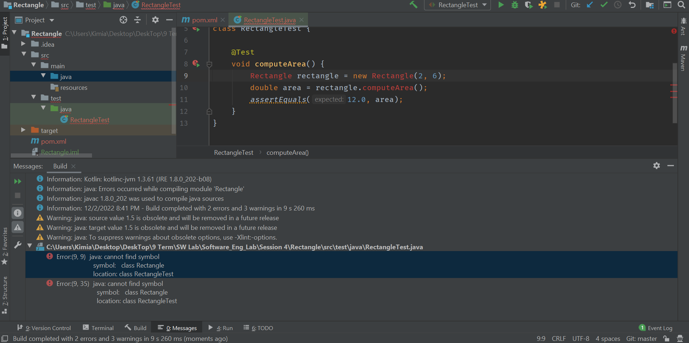
    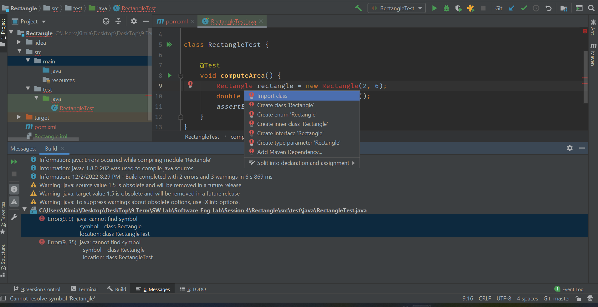
    Then, we implement the Rectangle class and the computeArea function and then run the test again:
    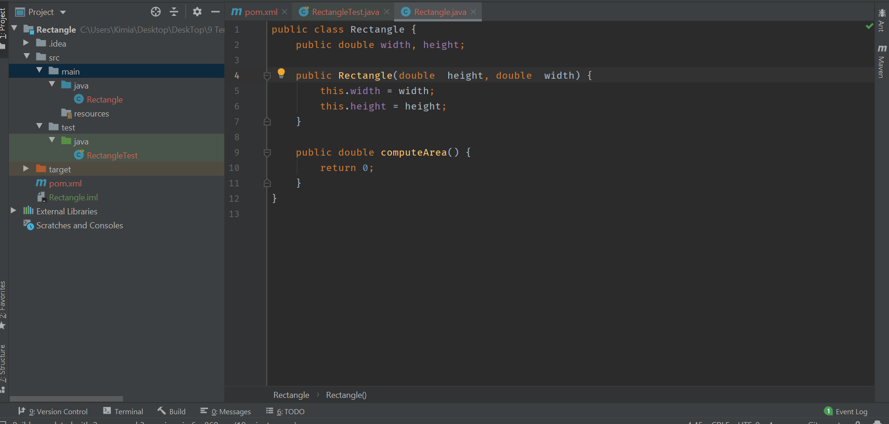
    Then we run the test again and we encounter the following error (errors during run-time):
    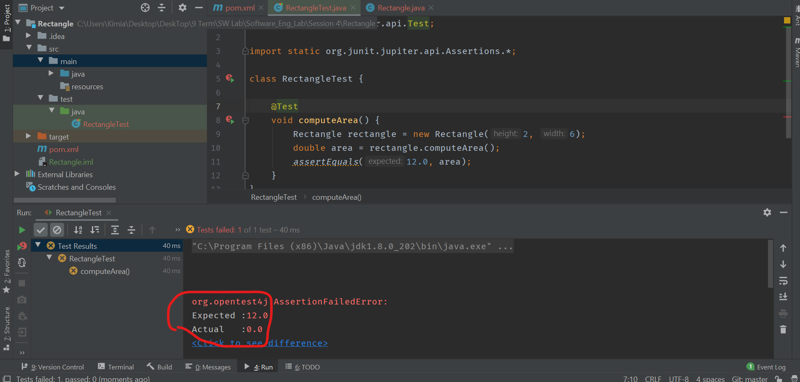
    Then we correct our implementation and run again:
    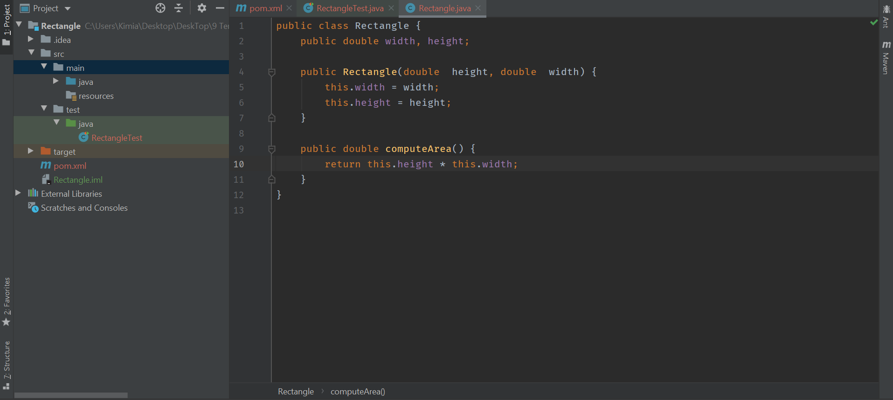
    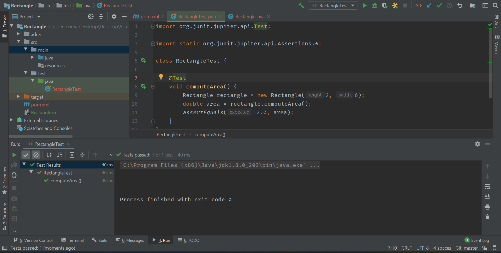

2. 
    First, we implement the tests for getter and setter of the width and the height and we run the test and we encounter the following error:
    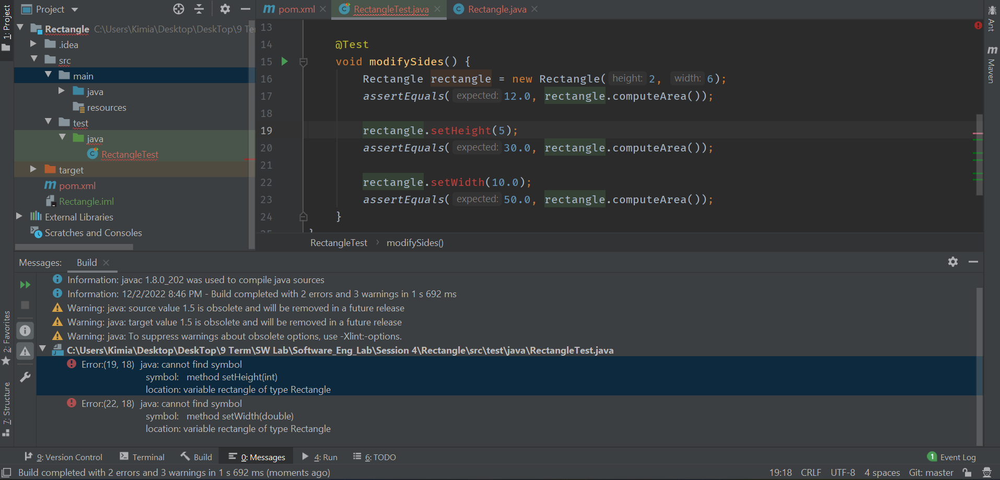
    Then we implement the getter and setter and run the test again:
    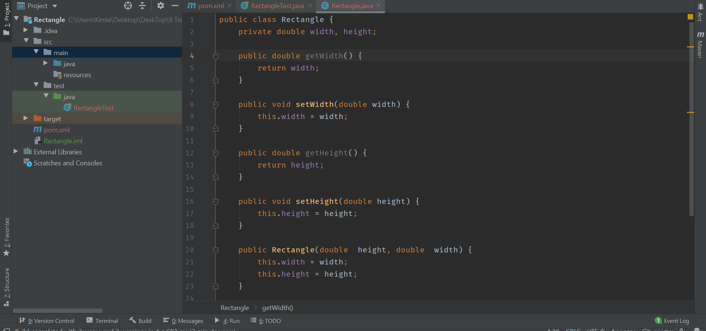
    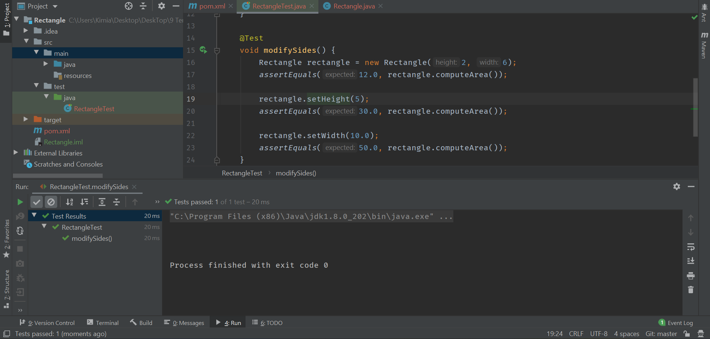

3. 
    First, we implement an interface called Shape that both the Rectangle and the Square classes implement:
    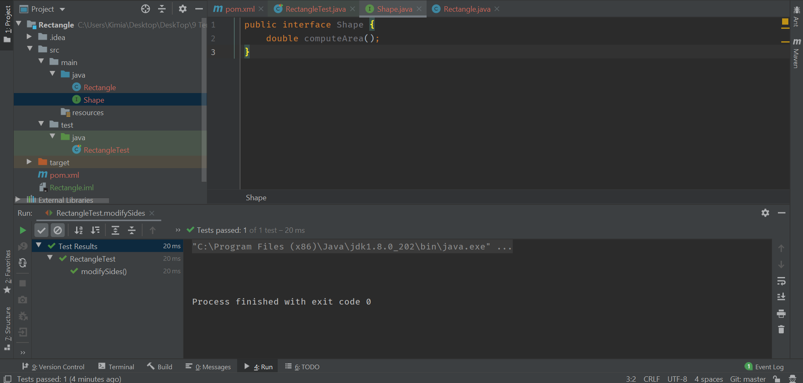
    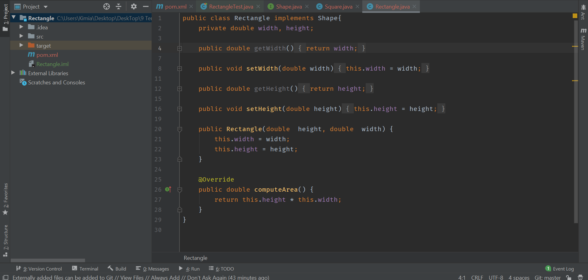
    Then we impelement a test for this Square class and fail:
    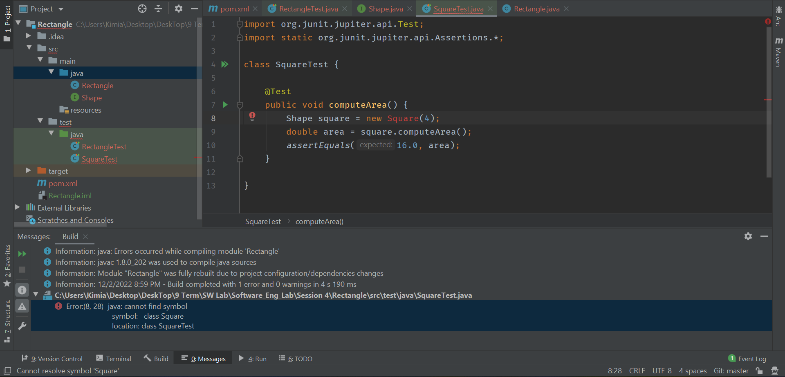

    Then we create the Square class and run the test again:
    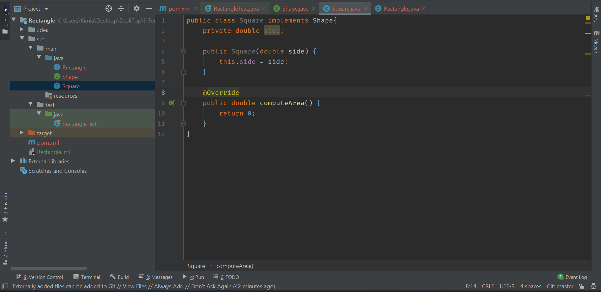
    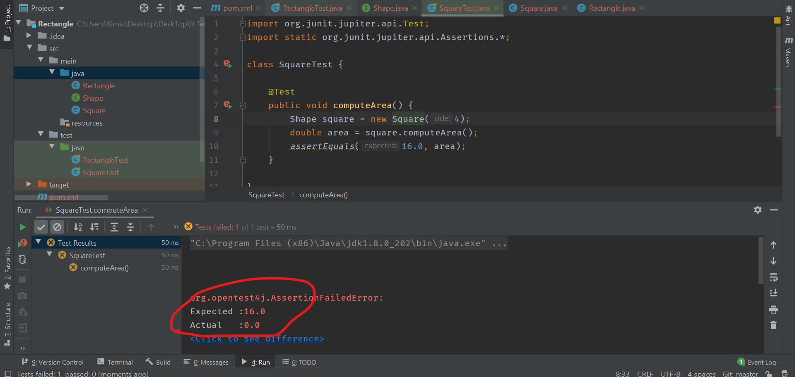
    The test fails because of the run-time error. Now we correct the implementation and run the test again:
    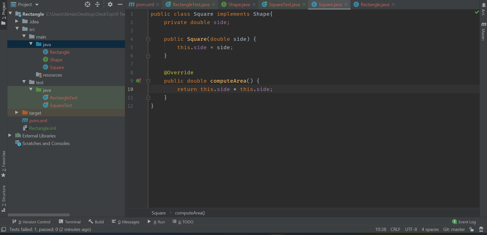
    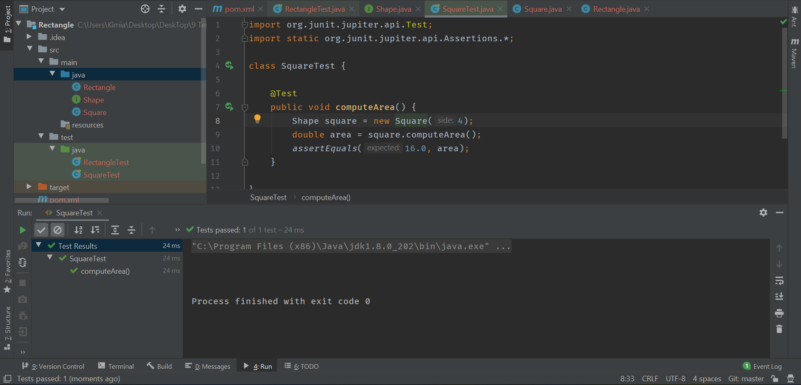

    We also add the getter and setter for Square class and test them (please see the code in the repository).

# Questions

<b> سوال اول</b>

اصل اول: Single responsibility principle

این اصل به این معنا نیست که کلاس باید یک کار انجام بدهد، بلکه به این 
معناست که 
کلاس باید فقط یک دلیل برای تغییر داشته باشد. در واقع یعنی یک کلاس باید فقط و فقط به یک actor پاسخگو باشد. یعنی حتی اگر کلاس چندین کار هم انجام داد، این باید فقط و فقط در راستای پاسخگویی به یک actor باشد. 

اصل دوم: Open/closed principle

یعنی کلاسی که مینویسیم باید برای گسترش دادنش باز باشد، اما برای تغییر دادنش بسته باشد. به این معنی که بتوان به راحتی یک قابلیت جدید به کلاس اضافه کرد، بدون آن که مجبور باشیم کد کلاس را تغییر دهیم. یکی از راه های براورده کردن این اصل، رعایت اصل DIP است که اصل آخر است. 

اصل سوم: Liskov substitution principle

این اصل به این معنا است که کلاس فرزند باید بتواند جایگزین کلاس والد باشد. میدانیم هر کلاسی یک سری pre-condition و یک سری post-condition دارد. این اصل به آن معناست که هر متدی که در کلاس فرزند است و آن را از کلاس والد به ارث برده است، نباید pre-condition قوی تری داشته باشد و همچنین نباید post-condition ضعیف تری داشته باشد.

اصل چهارم: Interface segregation principle

این اصل به این معنی است که یک واسط general خیلی بدتر از چند واسط cohesive است.
در واقع بهتر است که یک وایط چندین کار را انجام ندهد. 

اصل پنجم: Dependency inversion principle

فرض کنید یک کلاس A و یک کلاس B داریم که بین آنها رابطه association برقرار است، یعنی یک فیلدی از B  در A استفاده میشود. 
این اصل میگوید که بتر است کلاس B کلاسی abstract باشد و concrete نباشد.
در واقع کلاس A به به specification وابسته باشد و  نه به پیاده سازی کلاس B.  

<b> سوال دوم</b>
تعداد زیادی اصول برای مرحله طراحی نرم افزار ها وجود دارد که یکی از آن ها اصول SOLID است.این اصول به این منظور طراحی شده اند که معماری یک برنامه کاربردی را انعطاف پذیرتر، مقیاس پذیرتر و قابل نگهداری تر کنند. اجرای آنها در کار شما می تواند پیچیدگی کلی پروژه را نیز افزایش دهد.

<b> سوال سوم</b>

هسته TDD نوشتن تست قبل از هر کد تولید است. این اساساً با نحوه انجام کارها در تضاد است. ما می خواهیم کار را سریع به پایان برسانیم و فقط آنچه را که ارسال می شود بنویسیم. ما کد آزمایشی را ارسال نمی کنیم، بنابراین می خواهیم فقط کد نهایی را بنویسیم و با آن کار تمام شود.

تست‌های نوشتاری، توسعه‌دهنده را مجبور می‌کند تا قبل از کدنویسی، یک بار دیگر به تمام الزامات فکر کند، که این چیز خوبی است. اغلب به حذف برخی از فرضیات نامربوط که توسعه‌دهنده ناخودآگاه مطرح کرده‌اند کمک می‌کند. ترجمه الزامات متن به کد اغلب موارد حاشیه ای را نشان می‌دهد که تیم محصول قبلاً به آنها فکر نکرده بود. با این حال، این کار اضافی از .
فکر کردن، هنوز هم کار بیشتری بر دوش توسعه دهنده است.

بدون شک TDD سخت است، اما مزایای زیادی دارد. این به ما کمک می کند تا روی نیازمندی ها تمرکز بهتری داشته باشیم، با اطمینان اصلاح کنیم، کد را برای داشتن مسئولیت واحد و رابط های بهتر اجرا کنیم.

<b> سوال چهارم</b>

