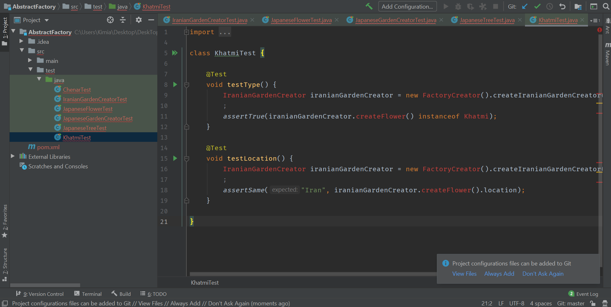
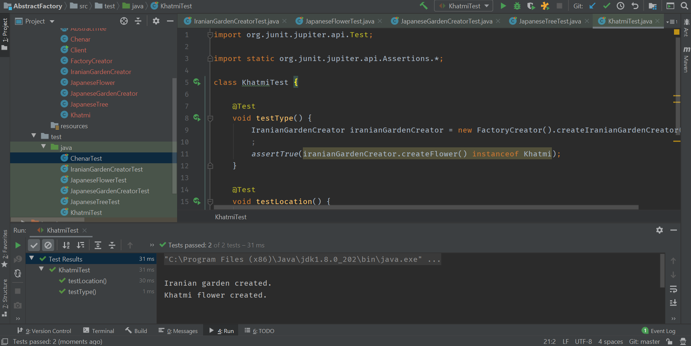
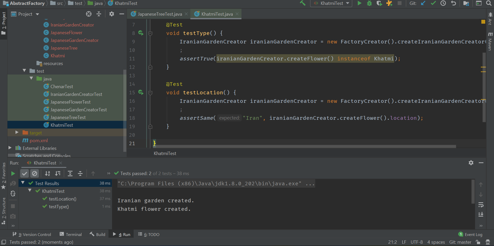
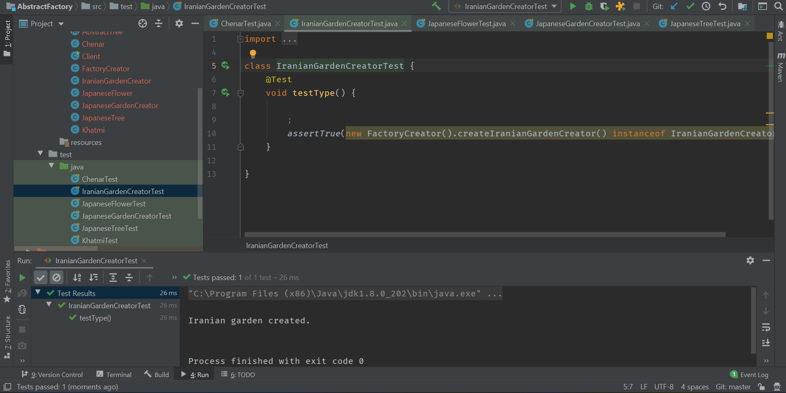
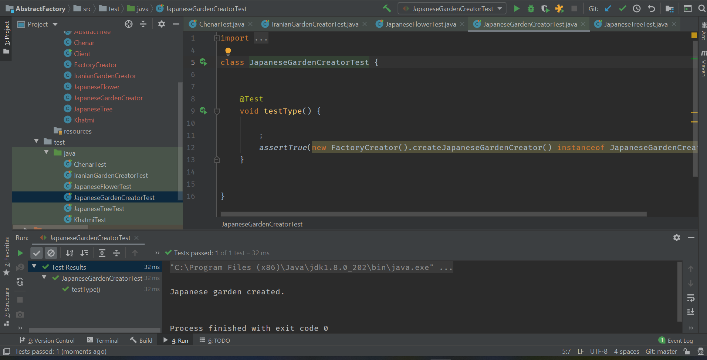
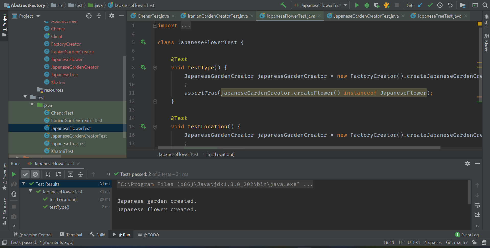
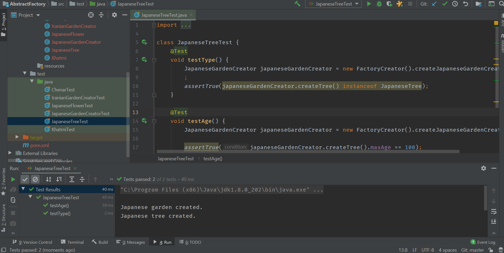

# Abstract Factory 

First, we implement the test for the Iranian/Japanese garden project: 

Then, we implement the Abstract Factory pattern and run the tests (All of them passed): 

# Prototype

# Builder

# Questions

## Q1:
1. Creational design patterns: Creational patterns are used to create objects for a suitable class that serves as a solution for a problem. Generally when instances of several different classes are available. They are particularly useful when you are taking advantage of polymorphism and need to choose between different classes at runtime rather than compile time.

2. Structural design patterns: Structural patterns form larger structures from individual parts, generally of different classes.Structural patterns vary a great deal depending on what sort of structure is being created for what purpose. Structural patterns are concerned with how classes and objects are composed to form larger structures. Structural class patterns use inheritance to compose interfaces or implementations. 

4. Behavioral design patterns: Behavioral patterns describe interactions between objects and focus on how objects communicate with each other. They can reduce complex flow charts to mere interconnections between objects of various classes. Behavioral patterns are also used to make the algorithm that a class uses simply another parameter that is adjustable at runtime. Behavioral patterns are concerned with algorithms and the assignment of responsibilities between objects.
