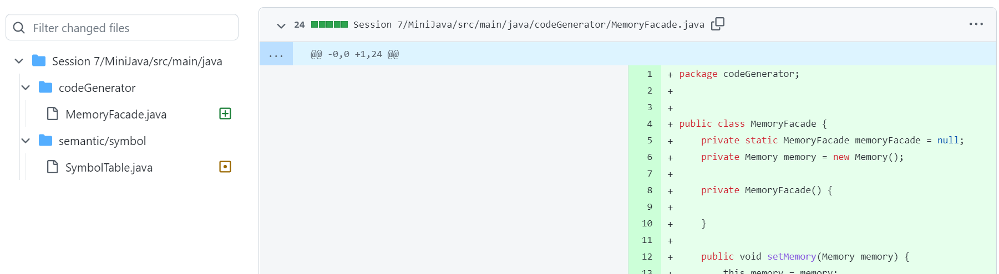

## List of refactoring commits:
- Facade: [CodeGeneratorFacade](https://github.com/Mobinapournemat/Software_Eng_Lab/commit/ab65fd3aad780c90f0270bf75bc9fc163e8ddfa7), [MemoryFacade](https://github.com/Mobinapournemat/Software_Eng_Lab/commit/7c464d26c84b95ed322009f33330d229705f4aa2)
- [Separate query from modifier](https://github.com/Mobinapournemat/Software_Eng_Lab/commit/8a5d62f067a35d28a1ab5564773e159c4d3b909a)
- [Loose coupling](https://github.com/Mobinapournemat/Software_Eng_Lab/commit/aa55fffc1bedf087c2e786804920a847bdd4bb5d)
- [Self Encapsulated Field](https://github.com/Mobinapournemat/Software_Eng_Lab/commit/f1b1552501c71eed6b3f739d48c5922c71b129ae)
- [Remove Switch Statement](https://github.com/Mobinapournemat/Software_Eng_Lab/commit/234ec09804cad2b2b6c0ac4f54cbe9a1f272e717)
## Loose Coupling

Loose Coupling به نوعی معماری در توسعهٔ سیستم‌های نرم‌افزاری گفته می‌شود که در آن، کامپوننت‌ها یا بخش‌های مختلف اپلیکیشن تا حد ممکن مستقل از یکدیگر خواهند بود. به عبارت دیگر، این اصطلاح به میزان ارتباط مستقیم ماژول‌های مختلف اپلیکیشن با یکدیگر اطلاق می‌گردد.

 

 
## Facade

الگوی طراحی فِساد زیرشاخۀ الگوهای طراحی Structural قرار می‌گیرد و استفاده از آن در شرایطی مؤثر واقع می‌شود که کدی پیچیده داشته باشیم که با چندین کلاس مختلف پیاده‌سازی شده است یا زمانی که یک کد به اصطلاح Legacy (قدیمی) داریم که ریفکتور کردن آن بسیار دشوار و زمان‌بر می‌باشد که در چنین شرایطی با استفاده از دیزاین پترن فِساد یک کلاسی می‌سازیم که امکان ارجاع به تمامی کلاس‌های اپلیکیشن را داشته و در نهایت می‌توانیم متدهای مد نظر خود را از طریق تنها یک متد فراخوانی کنیم که این امر منجر به کاهش پیچیدگی ساختار سیستم می‌شود. 
  
  ما در پروژه یک MemoryFacade و یک CodeGeneratorFacade ساختیم. 

 

 
## Remove switch statemnets

  استفاده نسبتاً نادر از عملگرهای سوئیچ و کیس یکی از مشخصه های کد شی گرا است. اغلب کد برای یک سوئیچ می تواند در مکان های مختلف برنامه پراکنده شود. هنگامی که یک شرط جدید اضافه می شود، باید تمام کد سوئیچ را پیدا کرده و آن را تغییر دهید.

  
 

 

## Separate Query from Modifier

در شرایطی که یک تابع داریم که هم وظیفه برگرداندن یک مقدار و هم وظیفه تغییر دادن object  را دارد، بهتر است آن تابع را به دو تابع مجزا تقسیم کنیم که وظیفه یکی برگرداندن مقدار مورد انتظار و وظیفه دیگری تغییر دادن آن object است. 

 

 

## Self Encapsulated Field

در شرایطی که attribute های یک کلاس private باشند، نمی توانیم از طریق کلاس های دیگر به آن ها دسترسی خواندن و نوشتن داشته باشیم. در چنین شرایطی باید از متد های getter و setter استفاده کنیم که متد getter امکان خواندن attribute ها و متد setter برای ست کردن مقادیر کاربرد دارد. 

 

 

## Questions

<b> سوال اول</b>
کد تمیز یا clean code: کدنویسی تمیز (Clean Code) مجموعه اصولی است که به شما کمک می‌کند کدی بنویسید، که فهم و اصلاح آن توسط دیگران و یا بعد از مدت‌های طولانی برای خودتان سخت نباشد. این اصول استانداردهایی هستند که اگر رعایت شوند، شما را تبدیل به یک برنامه نویس حرفه ای می‌کنند. کدنویسی تمیز در کار گروهی اهمیت بسیار زیادی دارد. در متدولوژی هایی مانند چابک (Agile) کدنویسی تمیز ضروری به نظر می‌رسد زیرا اعضای تیم، در بسیاری از موارد ناچار به تکمیل و اصلاح کدهای یکدیگر هستند.

 بدهی فنی یا technical debt: بدهی فنی اصطلاحی در صنعت توسعهٔ نرم‌افزار است که طی آن دولوپر به جای صَرف زمان زیاد و یافتن درست‌ترین و بهترین راه‌حل در حین کدنویسی، یک راه‌حل آسان و فوری را برای حل موقت یک مسئله به کار می‌گیرد و در عوض متعهد می‌گردد که در آینده و پس از تکمیل پروژه، زمانی را برای یافتن راه‌حلی اصولی‌تر و حتی تغییر بخشی از کد‌ها جهت جایگزین نمودن راه‌حل درست با راه‌حل موقت صرف نماید که این رویکرد را شاید بتوان چیزی شبیه بهره‌ٔ وام در نظر گرفت. 

بوی بد یا bad smell: به زبان ساده، بوی کد نتیجه برنامه نویسی ضعیف یا نادرست است. بوهای کد در برنامه اغلب می تواند مستقیماً به اشتباهات برنامه نویس برنامه در طول فرآیند کدنویسی ردیابی شود. به طور معمول، بوی کد ناشی از عدم نوشتن کد مطابق با استانداردهای لازم است.  

<b> سوال دوم</b>
1. Bloaters

آنها کد، متدها و کلاس هایی هستند که به اندازه های عظیمی افزایش یافته اند که کار کردن با آنها سخت است. معمولاً این بوها فوراً ظاهر نمی شوند، بلکه در طول زمان و با تکامل برنامه جمع می شوند (و مخصوصاً وقتی کسی تلاشی برای از بین بردن آنها نمی کند). مثل متدها و کلاس های طولانی

2. Object-Orientation Abusers

  این بوها کاربرد ناقص یا نادرست اصول برنامه نویسی شی گرا هستند. مثل switch statement ها، کلاس های متفاوت با interface های مختلف

3. Change Preventers

 این بوها به این معنی است که اگر شما نیاز به تغییر چیزی در یک مکان در کد خود دارید، باید در جاهای دیگر نیز تغییرات زیادی ایجاد کنید. در نتیجه توسعه برنامه بسیار پیچیده تر و گران تر می شود.

4. Dispensables

یک dispensable یک چیز بی‌معنی و غیر ضروری است که نبود آن کد را پاک‌تر، کارآمدتر و درک آسان‌تر می‌کند. مثل کامنت ها، کد های duplicate شده، dead code ها و ...

5. Couplers

همه بوهای موجود در این گروه به وابسته شدن بیش از حد بین کلاس ها کمک می کند یا نشان می دهد که اگر coupling با تفویض بیش از حد جایگزین شود چه اتفاقی می افتد. مثل middle man، feature envy و ...

<b> سوال سوم</b>

