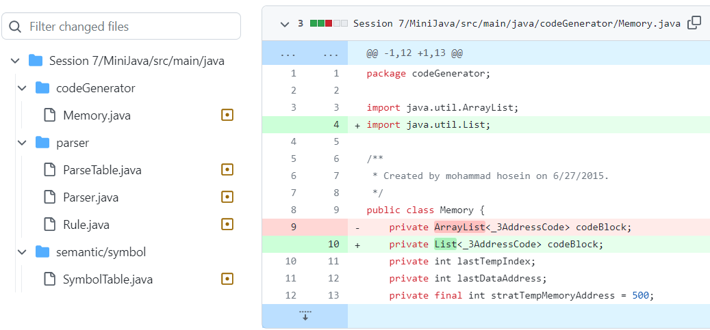
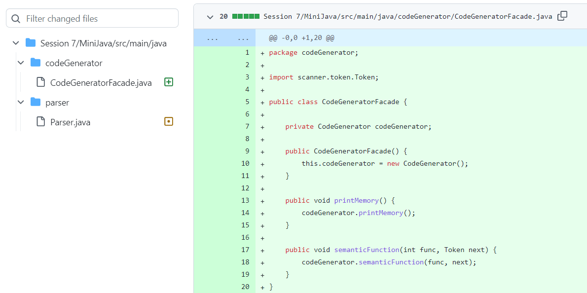
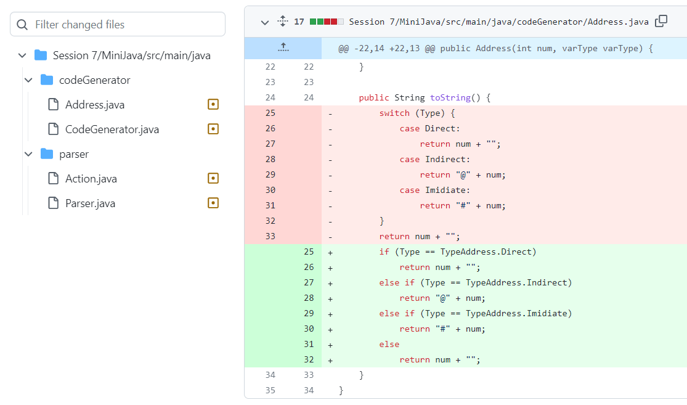
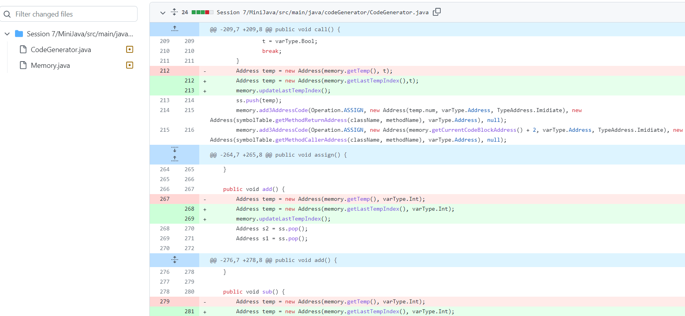
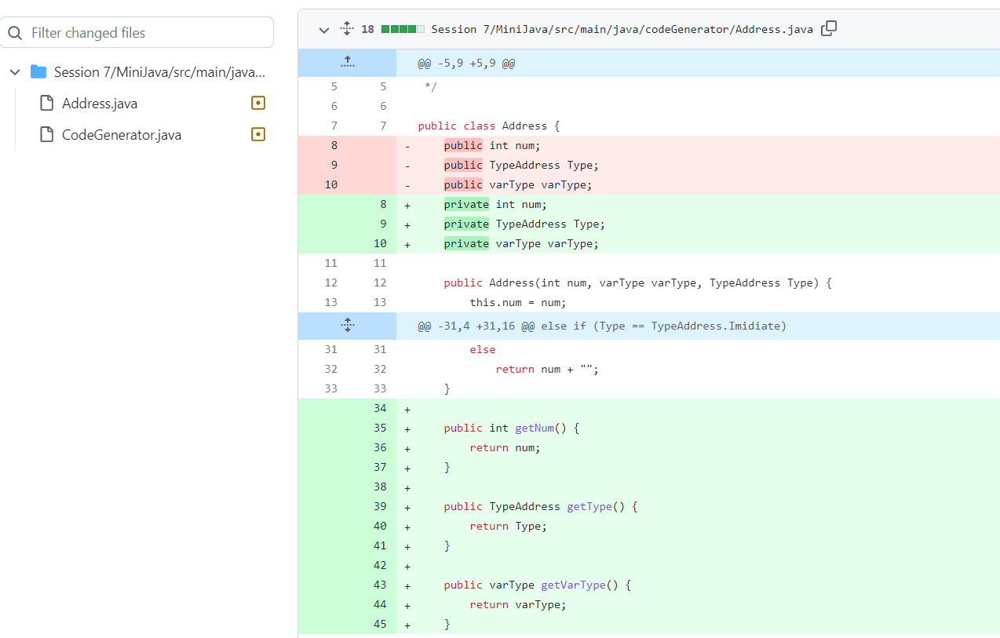

## Loose Coupling

Loose Coupling به نوعی معماری در توسعهٔ سیستم‌های نرم‌افزاری گفته می‌شود که در آن، کامپوننت‌ها یا بخش‌های مختلف اپلیکیشن تا حد ممکن مستقل از یکدیگر خواهند بود. به عبارت دیگر، این اصطلاح به میزان ارتباط مستقیم ماژول‌های مختلف اپلیکیشن با یکدیگر اطلاق می‌گردد.

 

 
## Facade

الگوی طراحی فِساد زیرشاخۀ الگوهای طراحی Structural قرار می‌گیرد و استفاده از آن در شرایطی مؤثر واقع می‌شود که کدی پیچیده داشته باشیم که با چندین کلاس مختلف پیاده‌سازی شده است یا زمانی که یک کد به اصطلاح Legacy (قدیمی) داریم که ریفکتور کردن آن بسیار دشوار و زمان‌بر می‌باشد که در چنین شرایطی با استفاده از دیزاین پترن فِساد یک کلاسی می‌سازیم که امکان ارجاع به تمامی کلاس‌های اپلیکیشن را داشته و در نهایت می‌توانیم متدهای مد نظر خود را از طریق تنها یک متد فراخوانی کنیم که این امر منجر به کاهش پیچیدگی ساختار سیستم می‌شود. 
  
  ما در پروژه یک MemoryFacade و یک CodeGeneratorFacade ساختیم. 

 

 
## Remove switch statemnets

  استفاده نسبتاً نادر از عملگرهای سوئیچ و کیس یکی از مشخصه های کد شی گرا است. اغلب کد برای یک سوئیچ می تواند در مکان های مختلف برنامه پراکنده شود. هنگامی که یک شرط جدید اضافه می شود، باید تمام کد سوئیچ را پیدا کرده و آن را تغییر دهید.

  
 

 

## Separate Query from Modifier

در شرایطی که یک تابع داریم که هم وظیفه برگرداندن یک مقدار و هم وظیفه تغییر دادن object  را دارد، بهتر است آن تابع را به دو تابع مجزا تقسیم کنیم که وظیفه یکی برگرداندن مقدار مورد انتظار و وظیفه دیگری تغییر دادن آن object است. 

 

 

## Self Encapsulated Field

در شرایطی که attribute های یک کلاس private باشند، نمی توانیم از طریق کلاس های دیگر به آن ها دسترسی خواندن و نوشتن داشته باشیم. در چنین شرایطی باید از متد های getter و setter استفاده کنیم که متد getter امکان خواندن attribute ها و متد setter برای ست کردن مقادیر کاربرد دارد. 

 

 
